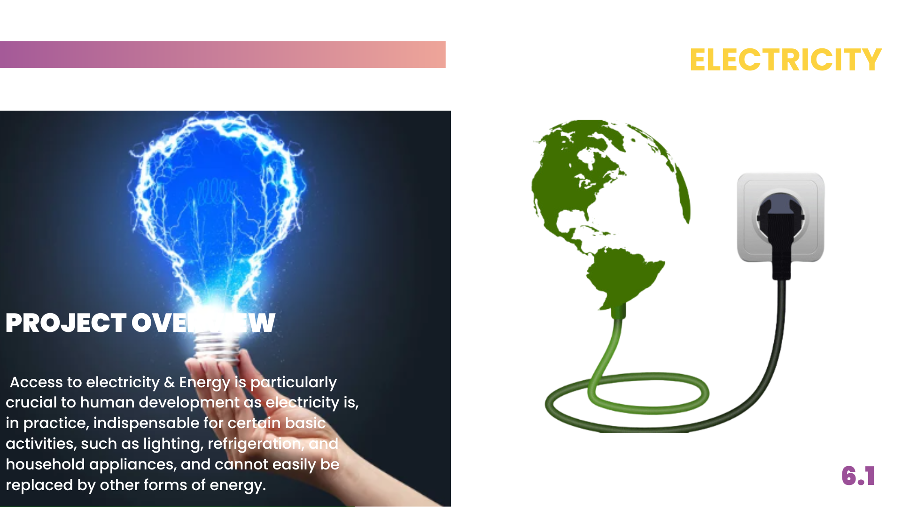

# AcesstoElectricity

                        
                    </a>

# Project Overview
Access to electricity & Energy is particularly crucial to human development as electricity is, in practice, indispensable for certain basic activities, such as lighting, refrigeration, and household appliances, and cannot easily be replaced by other forms of energy. 

# Key  Questions

### Energy Access and Consumption:
Energy access and consumption patterns are directly linked, allowing for the categorization of regions for infrastructure development based on their energy access and consumption patterns. 
### Carbon Emission Forecasting:
Access to electricity shows a weak to negative relationship with low carbon emissions.
### Energy Equity Analysis:
GDP per capita has a moderate positive relationship with access to electricity and access to clean fuels for cooking.
### Renewable Energy Potential Assessment and Investment Strategies:
Renewable energy potential is moderately positively correlated with GDP per capita, and higher usage could reduce overall energy consumption rates. 

# Limitations and Ethical Considerations
- Data completeness: The dataset contain variables that are missing for some years and in some countries. This is likely in part due to the fact that were not available from various global government entities and in some cases, certain metrics may have not been adequately tracked. Fortunately, there are enough variables that I will be able to find stretches to compare variables across regions and time accurately.
- Privacy & PII: Privacy and individual information should always be taken seriously. However, I am using reputable data sources that don't include any personally identifiable information so I will not have to worry much about the data and analysis I make public.
- Data Usage (discrimination): Any insights here should not be used to negatively generalize or discriminate against a specific population or culture.
 - Data Usage (health): Any insights regarding health should not be used as medical advice and should be scrutinized further if used in any authoritative   capacity.

# Key Questions/ Potential Use Cases
- Energy Production, Consumption, and Prediction: The Data aid planning, and prediction for future energy usage.
- Energy Access classification: Categorize regions for infrastructure development, understanding sustainable energy role.
- Carbon Emission Forecasting: forcast CO2 emissions, support climate strategies.
- Sustainable Development Goal Tracking: Monitor Progress towards Goal 7, evaluate policy  impact.
- Energy Equity Analysis: Analyze access, density, and growth for equitable distribution 
- Energy efficiency Optimization: identify intensive areas for environmental impact reduction.
- Renewable Energy Potential assessment: identify regions for green investments based on capacity.
- Renewable Energy investment strategies: guide investors towards sustainable opportunities.
- Country income Grouping: These will guide investor in understanding the purchase power of the population.
- Regional Energy Production, Consumption, and Prediction.

